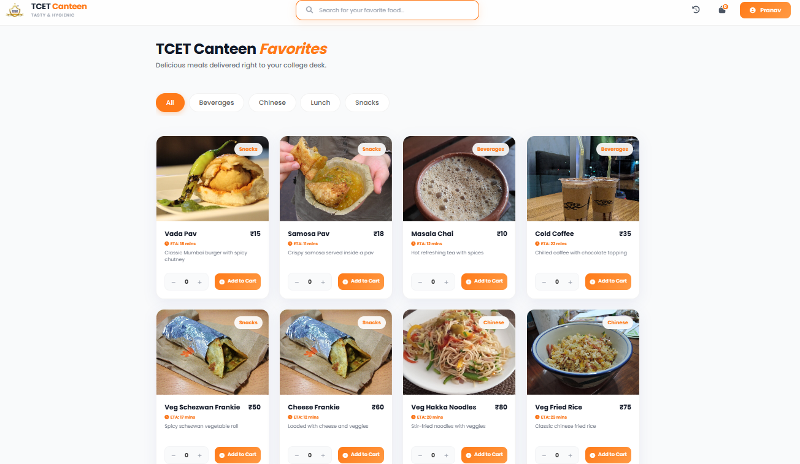
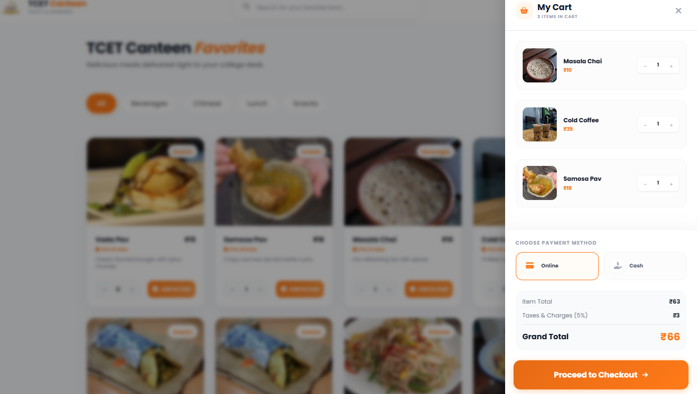
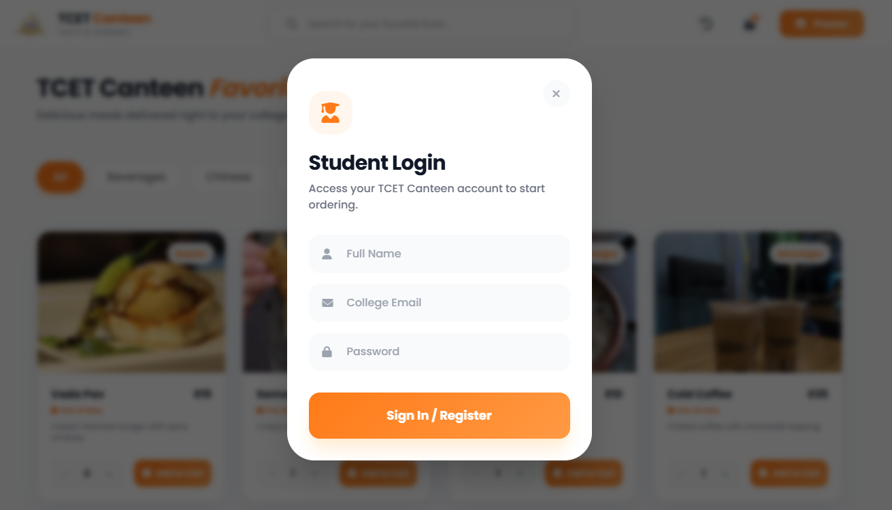
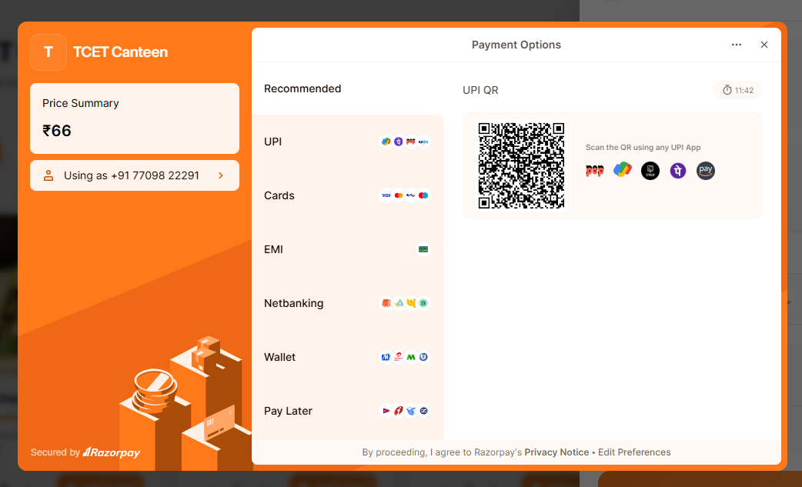

# 🍔 TCET Canteen - Smart Food Ordering System

A modern full-stack food ordering platform built for TCET students to skip queues and order food seamlessly.

🌐 **Live Website:** https://smart-food-ordering-website.vercel.app

---

## 🚀 Features

- 🛒 Add to Cart & Checkout
- 💳 Online Payments (Razorpay Integration)
- 📦 Order Tracking System
- 🔐 Student Login System
- 📱 Fully Responsive Design
- 🍽️ Category-based Menu Filtering

---

## 🛠️ Tech Stack

- Frontend: HTML, CSS, JavaScript, Tailwind CSS  
- Backend: Node.js, Express.js  
- Database: MongoDB  
- Payment Gateway: Razorpay  

---

## 🎯 Project Overview

This platform is designed as a **real-time campus food ordering system** to streamline canteen operations and improve student experience.

---

## 📸 Screenshots

### 🏠 Homepage

### 🛒 Cart

### Loginpage

### 💳 Payment

---

## 👨‍💻 Author

**Pranav Bhavsar**  
GitHub: https://github.com/PranavBhavsar-jpg  

---

## ⭐ Feedback

Feel free to explore the live website and share your feedback!